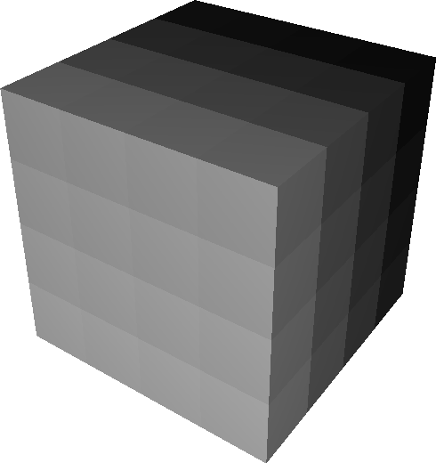
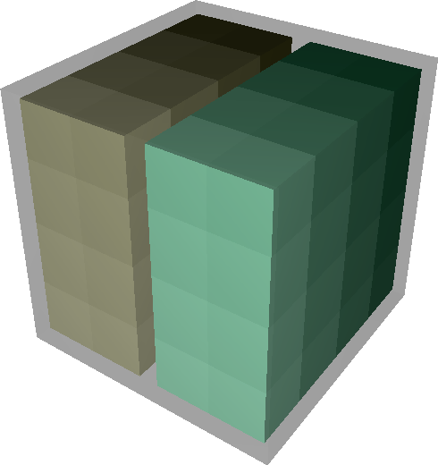
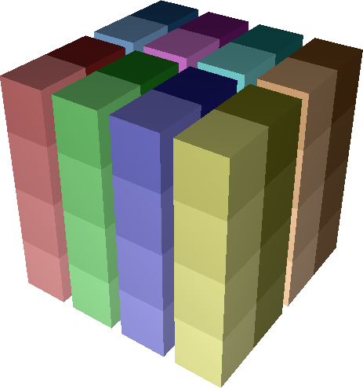
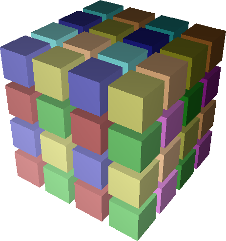
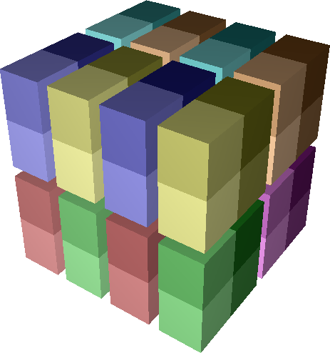
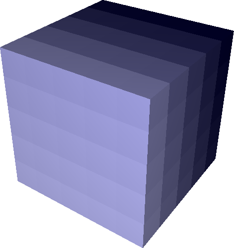
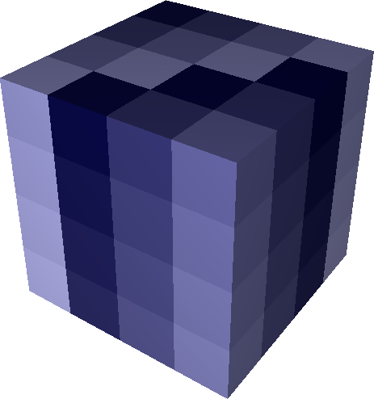
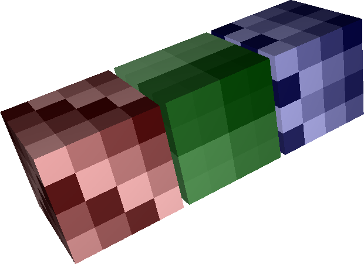

User Guide
==========

Rubik is a tool that simplifies the process of creating task mappings for
structured applications.  Rubik allows an application developer to specify
communicating groups of processes in a virtual application topology succinctly
and map them onto groups of processors in a physical network topology.  Both
the application topology and the network topology must be Cartesian, but the
dimensionality of either is arbitrary.  This allows users to easily map
low-dimensional structures such as planes to higher-dimensional structures like
cubes to increase the number of links used for routing.

Rubik also provides embedding operations that adjust the way tasks are laid out
within groups.  These operations are intended to optimize particular types of
communication among ranks in a group, either by shifting them to increase the
number of available links for communication between processor pairs or by
moving communicating ranks closer together on the Cartesian topology to reduce
latency.  In conjunction with Rubik's mapping semantics, these operations allow
users to create a wide variety of task layouts for structured codes by
composing a few fundamental operations, which we describe in the following
sections.

Partition Trees
---------------

The fundamental data structure in Rubik is the *partition tree*, a hierarchy of
*n*-D Cartesian spaces. We use partition trees to specify groups of tasks (or
processes) in the parallel application and groups of processors (or nodes) on
the network.  Nodes of a partition tree represent boxes, where a *box* is an
*n*-D Cartesian space.  Each element in a box is an object that could be a task
or a processor.  New boxes are filled by default with objects numbered by rank
(much like MPI communicators).

Every partition tree starts with a single root *box* representing the full
*n*-D Cartesian space to be partitioned.  We construct a box from a list of its
dimensions, e.g., a 4 x 4 x 4 3D application domain.  From the root, the tree
is subdivided into smaller child boxes representing communication groups (MPI
sub-communicators) in the application.  Child boxes in a partition tree are
disjoint, and the union of any node's child boxes is its own box.  Unlike other
tools, which are are restricted to two or three dimensions, Rubik's syntax
works for any number of dimensions. An arbitrary number of dimensions can be
specified when a box is constructed.

.. image:: images/partition-3.png
   :scale: 20 %
   :align: right
 
The Rubik code below is used to construct a partition tree::

    domain = box([4,4,4])  # a. Create a cube
    domain.div([1,1,2])    # b. Divide into halves
    for child in domain:
	child.div([2,1,2]) # c. Divide each half into 4

On line 1, we construct a 4 x 4 x 4 domain using the ``box`` command.  This
creates a one-level tree with a single box of 64 tasks (figure on the right).
In line 2, we use Rubik's ``div`` command to split this tree along the third
dimension into two boxes of 32 tasks, which fully cover the original box.
Lines 3 and 4 loop over the newly created children and further split each child
into 4 children of its own, with 8 tasks each.

The cubes in the figures on the right show the Cartesian structure of the tree.
Leaf nodes are nested in transparent halos of their parent boxes.  Each leaf
box is given a unique color, and object numbering (MPI rank) within each leaf
box is shown using a color gradient.  The lowest rank within a leaf box has the
lightest color.  The tree diagrams below the cubes show the partition tree
structure with boxes shown as nodes and labeled by the number of tasks they
contain.

Partitioning Operations
^^^^^^^^^^^^^^^^^^^^^^^
The ``div`` operation used in the previous section is one of four operations in
Rubik that divide a box into children: ``div``, ``tile``, ``mod`` and ``cut``.
Like the ``box`` constructor, these operations can be used on an arbitrary
number of dimensions.

**Div**: ``div`` takes a set of *divisors* `d_0, d_1, ... d_n` as argument, one
for each dimension of the box it divides.  It slices the parent box into `d_i`
groups along dimension $i$, creating `\prod_{i=0}^{n-1}{d_i}` child boxes.  The
child boxes form a `d_0 x d_1 x ... x d_n` space where the task at position
`(x_0, x_1, ..., x_n)` in the parent box is in the child box with index
`(\frac{x_0}{d_0}, \frac{x_1}{d_1}, ..., \frac{x_n}{d_n})`::

    app = box([4,4,4])
    app.div([2,1,4])

**Tile**: While ``div`` divides a space into a fixed number number of groups,
``tile`` divides a space into fixed-size child boxes, or $tiles$.  The number
of tiles created depends on the size of the box that ``tile`` is applied to.
Arguments to ``tile`` are tile dimensions rather than divisors.  Formally,
``tile`` on a `D_0 x D_1 x ... x D_n` space is equivalent to ``div`` with
divisors `\frac{D_0}{d_0}, \frac{D_1}{d_1}, ..., \frac{D_n}{d_n}`. The figure
on the right shows the same boxes created using ``div`` and ``tile``::

    app = box([4,4,4])
    app.tile([2,4,1])

**Mod** The ``mod`` operation shown on the right is similar to ``div`` in that
it also takes a list of `n` divisors and creates `\prod_{i=0}^{n-1}{d_i}` child
boxes.  However, ``mod``'s child boxes are interleaved, not contiguous.  With
``mod``, task `(x_0, x_1, ..., x_n)` will be a member of the child box `((x_0
\bmod d_0), (x_1 \bmod d_1), ..., (x_n \bmod d_n))`::

    app = box([4,4,4])
    app.mod([2,2,2])

**Cut** The ``cut`` operation shown on the right is a generalization of ``div``
and ``mod``. ``cut`` takes the same set of divisors as ``div`` and ``mod``, but
it also takes a second list that specifies the manner of slicing in each
dimension.  In the picture, we can clearly see that ``cut`` creates contiguous
slices along dimensions where ``div`` is specified, but along the third
dimension which uses ``mod``, the child boxes are interleaved::

    app = box([4,4,4])
    app.cut([2,2,2], [div,div,mod])

Mapping
-------
Partition trees in Rubik are used not only to specify groups of tasks in a
Cartesian application domain, but also to specify groups of processors on the
physical network.  The tool is designed to simplify the process of mapping
tasks between spaces with potentially different dimensionality.  A fundamental
example is that of mapping planes to boxes. Scientific applications may perform
collective operations within a plane in the application domain, but mapping a
plane directly onto a 3D mesh network will not maximize the number of physical
links available for communication within the plane.  Mapping the plane's tasks
to a higher dimensional space allows more bandwidth to be exploited.  Rubik
makes this easy by facilitating mapping for arbitrary number of dimensions.

The figure below shows two boxes of 216 objects subdivided into eight
27-object groups.  The first box's children are planes, and the second box's
children are cubes.  Regardless of the particular structure, the number of
leaves in the two partition trees is the same and each is of the same size.
Such trees are considered *compatible*.  Two compatible trees can be
``mapped`` by performing a simple breadth-first traversal of their leaves and
pairing off successive child boxes. The arrows in the figure show these
pairings for the example. For each pair, we take the tasks in the child boxes
in the application domain and copy them into the corresponding boxes in the
network domain.

.. image:: images/map-operation.jpg
   :scale: 15 %
   :align: right

Rubik code::

    # Create app partition tree of 27-task planes
    app = box([9,3,8])
    app.tile([9,3,1])

    # Create network partition tree of 27-processor cubes
    network = box([6,6,6])
    network.tile([3,3,3])

    network.map(app)  # Map task planes into cubes

The Rubik ``map`` operation reduces the burden of mapping multi-dimensional
spaces by allowing the user to think only in terms of group sizes.  The
particular shapes of groups are specified separately using the simple
partitioning operations discussed above. All that is required for a ``map``
is tree compatibility.

Writing map files
^^^^^^^^^^^^^^^^^
Once Rubik has mapped a set of tasks to a network decomposition, it can write
out map files suitable for use on a number of high performance computing
systems using ``write_map_file``.

Permuting operations
--------------------

.. image:: images/tilted-zx-xy.png
   :scale: 25 %
   :align: right

By default, the Rubik ``map`` operation copies ranks between Cartesian spaces
in scan-line order, with the highest-indexed dimension varying fastest.  While
this is an intuitive default order, a user may want to permute ranks within
groups to target bandwidth or latency optimizations.  Rubik has several
operations that allow tasks to be permuted to exploit properties of the
physical network: ``tilt``, ``zigzag``, and ``zorder``.

**Tilt** The ``tilt`` operation can increase the number of links available for
messaging on *n*-D Cartesian networks.  Conceptually, ``tilt(op1,op2,op3)``
selects one hyperplane (denoted by ``op1``) and a direction (``op2``) along
which an increasing number (``op3``) of shifts are applied normal to the
direction of the hyperplane. Shifts are applied in a circular fashion to all
parallel hyperplanes resulting in a permutation that "tilts" each hyperplane.
The figures on the right show multiple, successive applications of the tilt
operation to a 4 x 4 x 4 box.  On the left is an untilted box, with tasks
colored by identity (MPI rank) from lightest to darkest.  In the center, we see
the same tasks after permutation by one tilt, and on the right is the same box
after two tilts have been applied::

    Z, Y, X = 0, 1, 2  # Assign names to dimensions
    net = box([4,4,4]) # Create a box
    net.tilt(Z, X, 1)  # Tilt Z (XY) planes along X
    net.tilt(X, Y, 1)  # Tilt X (YZ) planes along Y

``tilt`` tries to increase the available links for communication between
neighbor tasks.  For example, by shifting hyperplanes normal to *X*, we add
links in the *X* dimension that neighbors can use for communication.
Successive tilts in additional dimensions add links in more dimensions.  The
higher the dimension of the network the more independent ``tilt``'s can be
performed and the more links can be exploited.

**Zigzag** The ``zigzag`` operation is similar to the tilt operation
in that it shifts hyperplanes along a dimension. However, rather than shifting
each successive plane by an increasing amount, ``zigzag`` only shifts
alternating segments by a constant amount.  This targets bandwidth in
effectively the same way that ``tilt`` does, by adding links along the
permuted dimension. However, ``zigzag`` has better latency properties than
``tilt`` since tasks stay closer to their starting point after a ``zigzag``
than they would with ``tilt``.

**Zorder** Z-ordering is a space-filling curve that maps a multi-dimensional
space to a linear curve while partially preserving multi-dimensional locality.
Space-filling curves have been used heavily in the mapping literature for
latency optimizations.  Rubik provides a ``zorder`` permutation operation for
this purpose, as well. Like other operations in Rubik, our ``zorder`` operation
can scale to an arbitrary number of dimensions. Rubik dynamically constructs
the necessary bit filters to translate high-dimensional Z codes, and ``zorder``
can be called on any type of box.

Hierarchical permutation
^^^^^^^^^^^^^^^^^^^^^^^^
Rubik permutations can be applied to boxes at any level of a partition tree.
The figure on the right shows a 192-task partition tree, ``net``.  The tree has
three 4 x 4 x 4 children.  Here, we apply a different permutation (``tilt``,
``zorder``, or ``zigzag``) to each child.  Accessing children is simple:
Rubik's partitioning operations define a `d_0 x d_1 x ... x d_n` subspace and
each element can be accessed via the corresponding subscript into this space.
In the example, one could call any of these operations on ``net``, and they
would apply to the *entire* box instead of a subgroup.

Rubik code::

    Z, Y, X = 0, 1, 2
    net = box([12,4,4])
    net.div([3,1,1])
    net[0,0,0].tilt(Z,X,1)
    net[0,0,0].tilt(X,Y,1)
    net[1,0,0].zorder()
    net[2,0,0].zigzag(Z,X,1)
    net[2,0,0].zigzag(X,Y,1)

Dimensionality-independent operations
-------------------------------------
As described above, all of Rubik's operations are dimensionality-independent.
They can apply to arbitrary number of dimensions, and the same operations that
are used on a 3D BG/P or Cray XT torus could be used on a 5D BG/Q torus, or on
a 6-dimensional tofu network of the K supercomputer.  Each operation is
designed so that it can be applied in a lower-dimensional space that is easy to
visualize, then scaled up in a regular fashion to higher dimensional spaces.
The visualization tool used to generate the figures in this paper takes the
same Python scripts as input that are used to generate the mappings.
Developers can view their mapping operations as they work, and this allows them
to reason intuitively about the effects of Rubik mappings in higher dimensions.

Rubik does not discover optimal network mappings automatically, nor is it
intended to do so.  It allows developers to leverage *a priori* knowledge
of the application and architecture and target latency and/or bandwidth
optimizations as the case maybe.  It also provides a framework within which
application developers can make reasonable mapping choices to quickly and
intuitively embed their applications in higher-dimensional Cartesian spaces.

